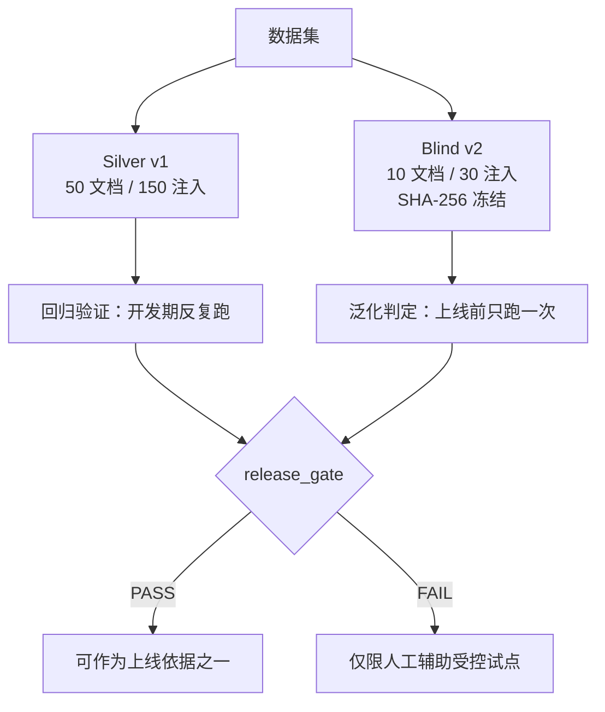

# 标书审核 Benchmark —— 设计原理与用法

> 本文件是对 `benchmark/` 目录评测体系的完整说明，回答三个问题：
> **它测什么？怎么设计的？怎么用？**
>
> 配套阅读：`benchmark/README.md`（速览）、`benchmark/NEXT_ROUND_GENERALIZATION_ARCHITECTURE.md`（下一轮改造）、`benchmark/FINAL_LAUNCH_ASSESSMENT_20260727.md`（上线评估存档）。

---

## 1. 一句话定位

这是一个 **Silver（银标准）审核质量评测**：它不判断真实招标文件是否违规，而是把**人工设计好的合规/合同风险条款，程序化追加到公开招标 PDF 的末页**，然后考察 Rust 审核引擎能不能把这些"已知植入的问题"找出来、分对类、标对严重度。

> 核心测的是：**系统的问题发现能力**（能不能找到已知问题、严重问题会不会漏检、同一版本迭代前后是否退化），**而不是**对原始文件的穷尽式合规审计。

---

## 2. 设计原理

### 2.1 两套"评分"：门禁分 vs 运行指标（先分清两个概念）

整个评测体系里有**两个**都叫"分/指标"、但维度完全不同的东西，读文档前先分清：

| | ① Benchmark 门禁分 | ② server「罗盘」运行指标 |
|---|---|---|
| 由谁算 | `benchmark/evaluate.py` | Rust 引擎 `MetricsCollector` |
| 算什么 | F1 / Precision / Recall / Critical 召回 | 耗时 / Token / 成本 / 发现数 / 严重度分布 |
| 判什么 | 是否达到上线门槛 `release_gate` | 单次实验的资源效率与产出 |
| 落地在哪 | `benchmark/results/<id>/metrics.json`、`summary.md` | `<AIBID_DATA_DIR>/output/runs/*.json` |
| 看哪里 | 命令行 / 上述文件 | `http://127.0.0.1:3001/metrics`（详见 §4） |

二者**同源**——都由同一个 Rust 引擎跑审核产生；但 ① 回答"找得准不准"，② 回答"跑得快不快、贵不贵、产出多少"。本节 §2.6–§2.7 讲的是 ①，§4 讲的是 ②。

### 2.2 两层基准：Silver v1（回归） + Blind v2（泛化）

这是整个设计最关键的一笔——**用两套数据集，把"有没有回归"和"能不能泛化"分开度量**。

| | Silver v1 | Blind v2 |
|---|---|---|
| 定位 | 开发期回归验证 | 上线前盲测（冻结） |
| 文档 | 50 份公开招标 PDF | 10 份**全新来源**，与 v1 来源零重叠 |
| 注入项 | 150 条（每份 3 条） | 30 条（每份 3 条，全新措辞） |
| 类别平衡 | 每份 Critical/High/Medium 各 1 | 15 类**各出现 2 次**；10 Critical + 10 High + 10 Medium |
| 防作弊 | 无 | SHA-256 冻结，任一文件改动即中止 |
| 能证明什么 | 同一版本迭代前后指标不退化 | 真正的泛化能力（上线依据） |



### 2.3 数据构造：末页"突变（mutation）"

每份原始 PDF 的处理流程（`build_dataset.py`）：

```
 公开原始 PDF  sources/BID-001.pdf   (例：120 页)
        │
        │ ① 下载 + 校验 PDF 头 / 页数 / SHA-256
        ▼
 ┌───────────────────────────────────────────┐
 │ ② reportlab 生成 1 页「附加测试条款」           │
 │    A4 + SimHei 黑体字体                       │
 │    标题行 + 3 条测试条款（各含引文原文）         │
 │    页脚注明："该页由基准构建程序追加…"          │
 │                                             │
 │    1. [Critical 条款]   （措辞变体）          │
 │    2. [High 条款]       （措辞变体）          │
 │    3. [Medium 条款]     （措辞变体）          │
 └───────────────────────────────────────────┘
        │
        │ ③ 追加到原 PDF 最后一页之后
        ▼
 mutated/BID-001_mutated.pdf  (121 页)  ← 交给引擎评测的文件
```

**三条注入条款的选择**（`build_dataset.py`）：

```python
selected = [
    critical[(index - 1) % 5],      # 1 条 Critical
    high[(index * 2 - 1) % 5],      # 1 条 High
    medium[(index * 3 - 1) % 5],    # 1 条 Medium
]
```

- 每条风险都配了多个 `variants`（同义改写模板），按 `(index + ordinal) % len(variants)` 轮换措辞，避免系统死记原文。
- 真值写入 `data/annotations.jsonl`，**每行一条 finding**，字段包含：`document_id`、`finding_id`、`category_code`、`risk_type`、`severity`、`is_critical`、`page_number`（= 原页数 + 1）、`source_quote`、`match_aliases`、`legal_basis`、`quote_similarity_threshold`、`split` 等。

**train / dev / test 划分**（`split_for`，按 50 份序号切）：

```
 1 ─── 30   train   （默认不参与正式验收）
31 ─── 40   dev
41 ─── 50   test    ← Silver v1 正式验收跑这 10 份
```

### 2.4 15 类风险分类体系（taxonomy）

这是 benchmark 的"题纲"。每一条真值都对应其中一类，且每类都带**法规依据、匹配别名、示例引文、修改建议**（`data/taxonomy.csv`）。

```
                 ┌────────────────────────────┐
                 │       15 类风险分类体系       │
                 └──────────────┬─────────────┘
      ┌─────────────────────────┼─────────────────────────┐
      ▼                         ▼                         ▼
 Critical（5）             High（5）                Medium（5）
 ─────────────             ─────────                ──────────
 C01 地域注册限制          H01 投标准备期不足       M01 验收标准模糊
 C02 指定品牌锁定          H02 保证金比例过高       M02 知识产权责任无限
 C03 无关资格条件          H03 厂家授权作资格       M03 单方无限变更需求
 C04 区域业绩限制          H04 主观评分未量化       M04 关键日期互相矛盾
 C05 经营规模门槛          H05 本地奖项加分        M05 违约责任口径不清
 is_critical = true        is_critical = false     is_critical = false
```

> **Critical 红线**是评测的重中之重：重大风险不仅要"被发现"，还必须"标对 `is_critical=true`"，两者结合才参与关键门禁（见 2.7）。

### 2.5 评估流水线

`run_benchmark.py` 负责无人值守跑评测（`run_acceptance.ps1` 是它的 Windows 封装，会自动编译/启动 Rust server）：

```
 freeze 校验(SHA-256) ─► 健康检查 /health
        │
        ▼
 逐文档循环（10 份 test）
   │  上传 PDF (multipart + desensitize_mode=low)
   │  → Rust 引擎解析出 engine_document_id
   │  → select_injection_chunks 定位「注入页」条款块
   │  → POST /review（chunk_ids + enabled_agents）
   │  → 轮询 /result 直到完成
   │  → normalize_finding 归一化字段
   │  → 断点续跑（每份结果写 <doc>.json，失败保留现场）
   ▼
 汇总 predictions ─► [可选] risk_policy.postprocess ─► evaluate.py ─► summary.md
```

**`risk_policy.py` 后处理**（确定性、离线、只用结构化字段 + 原文引文，绝不偷看 gold 标签，可安全回放）：

```
证据过滤 ─► 类别归一化 ─► Critical 重算 ─► 跨 Agent 去重
(丢空/标题样)  (证据优先)    (只看证据词组)   (同doc+同code+引文相似≥0.75)
```

### 2.6 评分核心：一对一匹配算法（`evaluate.py`）

最关键的设计限制：**它只评价"注入页"**。原文其他页上引擎发现的真实问题，被记为 `out_of_scope_predictions`，既不奖励也不罚为误报——因为那些页没做双人标注、无法判定对错。

```
 按 document_id 分组后，对每条真值 gold：
        │
        ▼
 in_scope 判定：页码 == 注入页 ？ 或  quote_similarity(引文) ≥ 0.45 ？
        │
        ├─ 否 ──► out_of_scope（不计分）
        │
        ▼ 是
 候选筛选：type_matches（category_code 相同 或 别名/risk_type 命中）？
        │
        ▼ 是
 算 quote_similarity（SequenceMatcher；子串完整包含 = 1.0，避免长引文被惩罚）
        + severity_bonus 0.05（严重度一致才加）
        │
        ▼
 每个 gold 选得分最高且相似度 ≥ 0.45 的候选  → TP
 没有候选命中                  → FN（漏检）
 未被任何 gold 消耗的 in_scope 预测 → FP（误报）
```

```
           ┌───────────┬────────────┐
           │  TP       │  FN        │  ← 相对 gold 真值
           └───────────┴────────────┘
           │  FP（in_scope 未命中）   │  ← 系统多报的
           └────────────────────────┘
           │ out_of_scope（原文页）    │  ← 不罚
           └────────────────────────┘
```

由此算出 **Precision / Recall / F1**，外加独立的 **Critical 指标**（检出率、标记召回率、severity 判定正确率、Critical Precision），并输出逐文档、逐类别、逐严重度细分 + 完整漏检清单。

### 2.7 上线门槛 `release_gate`

`evaluate.py` 内置的一票否决门禁，**四条同时满足**才算通过：

| 指标 | 门槛 |
|---|---:|
| F1 | ≥ 0.80 |
| Precision | ≥ 0.75 |
| Critical 标记召回率 | ≥ 0.95（重大问题必须被发现**且标对** `is_critical`） |
| Critical Precision | ≥ 0.80 |

另外 `run_benchmark.py` 还要求**全部文档成功完成、零失败**（`all_completed`）才判 PASS；退出码 `0` = PASS，`2` = FAIL。

### 2.8 防作弊：Blind v2 的冻结设计

`blind-v2` 是真正的"考卷"，专门防止"对着答案调 prompt / 规则"造成的过拟合：

```
 10 份全新来源 PDF ─► 追加 30 条新措辞问题 ─► 计算全部文件 SHA-256
                                                  │
                                                  ▼
                                        freeze_manifest.json
                                                  │
                                  run_benchmark.py 运行前自动复核
                                   任一文件被改 → 直接中止盲测
```

并且 PDF 上只显示"**补充条款一/二/三**"这种中性标题，**不显示风险名**，避免答案泄漏到输入里。

---

## 3. 用法

### 3.0 运行前准备

- 需要可用的 Python 环境（构建脚本依赖 `pypdf`、`reportlab`）。
- 需要中文黑体字体：`C:\Windows\Fonts\simhei.ttf`（`build_dataset.py` 硬编码此路径）。
- 需要可运行的 Rust 审核引擎（默认地址 `http://127.0.0.1:3001`）。
- `run_acceptance.ps1` 会自动 `cargo build --bin server` 并拉起引擎，也可用已启动的引擎（健康检查通过即可）。

### 3.1 构建数据集（重建 PDF + 真值）

在**仓库根目录**运行一次即可（首次会下载 50 份公开 PDF，重复运行复用已下载文件并校验哈希）：

```powershell
python benchmark/build_dataset.py
```

生成产物：

- `benchmark/sources/`：下载的原始公开 PDF（默认不提交 Git）
- `benchmark/mutated/`：追加注入页后的 PDF（默认不提交 Git）
- `benchmark/data/taxonomy.csv`：15 类风险分类表
- `benchmark/data/annotations.jsonl`：逐条真值（gold）
- `benchmark/data/source_manifest.csv|jsonl`：来源清单 / 下载状态 / 页数 / 哈希

### 3.2 一键无人值守验收（推荐）

双击 `benchmark/run_acceptance.cmd`，或命令行：

```powershell
powershell -ExecutionPolicy Bypass -File benchmark/run_acceptance.ps1
```

程序自动：启动引擎 → 上传 test 集 10 份 PDF → 定位注入页 → 运行全部审核 Agent → 轮询等待 → 汇总 → 评分 → 生成报告。

**先跑 1 份探针**（验证链路通顺，最快）：

```powershell
powershell -ExecutionPolicy Bypass -File benchmark/run_acceptance.ps1 `
  -Split test -Scope injected -RunId probe -Limit 1
```

**完整文档模式**（费用和耗时显著更高，仅审查模式不同）：

```powershell
powershell -ExecutionPolicy Bypass -File benchmark/run_acceptance.ps1 `
  -Split test -Scope full
```

`run_acceptance.ps1` 全部参数：

| 参数 | 默认 | 说明 |
|---|---|---|
| `-Split` | `test` | `train` / `dev` / `test` |
| `-Scope` | `injected` | `injected`（只审注入页）/ `full`（审整份文件） |
| `-RunId` | 自动生成 | 指定运行编号 |
| `-Limit` | `0`（全部） | 只跑前 N 份，用于探针 |
| `-Documents` | 空 | 逗号分隔的 document_id，定向探针 |
| `-DesensitizeMode` | `low` | `off` / `low`（正式验收固定 low） |
| `-DatasetRoot` | 空 | 数据集根目录；`blind-v2` 时指向 `benchmark/blind-v2` |

### 3.3 直接调用 `run_benchmark.py`

等价底层写法（更细粒度控制）：

```powershell
python benchmark/run_benchmark.py `
  --base-url http://127.0.0.1:3001 `
  --split test `
  --scope injected
```

完整参数：

| 参数 | 默认 | 说明 |
|---|---|---|
| `--base-url` | `http://127.0.0.1:3001` | Rust 引擎地址 |
| `--split` | `test` | `train` / `dev` / `test` |
| `--scope` | `injected` | `injected` / `full` |
| `--run-id` | 时间戳自动 | 运行编号 |
| `--agents` | 7 个默认 Agent | `fact_check procedure rule_engine semantic_risk scoring demand contract` |
| `--poll-seconds` | `5` | 轮询间隔（秒） |
| `--upload-timeout` | `900` | 上传超时（秒） |
| `--review-timeout` | `1800` | 审核超时（秒） |
| `--limit` | 无 | 只跑前 N 份 |
| `--documents` | 空 | 逗号分隔 document_id |
| `--no-resume` | 无 | 跳过断点续跑、强制重跑 |
| `--desensitize-mode` | `low` | `off` / `low` |
| `--dataset-root` | `benchmark` | 指向 `benchmark/blind-v2` 跑盲测 |

### 3.4 手动评分（已有 predictions 时）

```powershell
python benchmark/evaluate.py `
  --gold benchmark/data/annotations.jsonl `
  --pred your_predictions.jsonl `
  --output benchmark/results/metrics.json
```

`evaluate.py` 可选参数：`--include-splits`（默认 `dev,test`）、`--include-documents`（逗号分隔 document_id，用于探针/断点部分运行）。

### 3.5 运行 Blind v2 盲测

```powershell
# 1) 校验冻结集未被篡改
python benchmark/build_blind_v2.py --verify

# 2) 运行盲测（指向 blind-v2 数据集根目录）
python benchmark/run_benchmark.py `
  --base-url http://127.0.0.1:3001 `
  --dataset-root benchmark/blind-v2 `
  --split test `
  --scope injected
```

> 任何改动冻结数据（原始 PDF / 测试 PDF / 真值 / 来源清单）的行为都会在运行时被 SHA-256 复核发现并中止。

### 3.6 输出产物

每次运行在 `benchmark/results/<run-id>/`（或 `benchmark/blind-v2/results/<run-id>/`）下生成：

| 文件 | 说明 |
|---|---|
| `run_manifest.json` | 运行参数 / 数据集 / 冻结哈希 / 文档清单 |
| `progress.json` | 逐文档进度（已完成 / 失败 / 预测数） |
| `documents/<doc>.json` | 每份文档的断点缓存（含预测结果） |
| `predictions.jsonl` | 汇总后的系统输出（engine finding） |
| `metrics.json` | `evaluate.py` 完整评分（P/R/F1 + Critical + 逐类/逐文档） |
| `summary.json` | 门禁判定汇总 |
| `summary.md` | 人类可读验收报告（PASS / FAIL） |

## 4. 用 server「罗盘」查看单次实验指标（`/metrics`）

Rust `server` 内置一个实验指标仪表板（俗称"罗盘"，页面标题 **ai-bid Experiments**），用来横向对比历次审核的**运行指标**（耗时 / Token / 成本 / 发现数 / 严重度分布）。它就是 §2.1 里"② server 罗盘运行指标"的落地界面，这里只讲运行指标。

### 4.1 位置

| 组成 | 路径 |
|---|---|
| 页面本体（内嵌 HTML） | `backend-rust/src/api/metrics_dashboard.html` |
| 路由注册 | `backend-rust/src/api/router.rs`（`GET /metrics`） |
| 服务器入口（`bin server`） | `backend-rust/src/bin/server.rs` |
| 数据来源 | `<AIBID_DATA_DIR>/output/runs/*.json` |

### 4.2 启动与打开

```powershell
cd backend-rust
cargo run --bin server
```

监听地址默认 `http://127.0.0.1:3001`（可用环境变量 `AIBID_RUST_BIND` 改端口），然后浏览器打开：

```
http://127.0.0.1:3001/metrics
```

### 4.3 数据流

```
引擎每跑一次审核（CLI 或 server 的 /review）
        │  MetricsCollector.finalize(meta) → RunMetrics JSON
        ▼
写入 output/runs/<run_id>.json          ← 在 AIBID_DATA_DIR 下
  （设 AIBID_RUN_FOLDER=xx 时写入 output/runs/xx/ ）
        │
        ▼
GET /metrics → list_run_files() 递归扫描 output/runs/*.json
        │
        ▼
/api/v1/metrics/runs            列出摘要（表格/图表，按实验组分组）
/api/v1/metrics/runs/:run_id    单次完整详情
```

### 4.4 关键机制与后端接口

**实验组规则**：`output/runs/` 下的**子目录名即"实验组"**（`handlers.rs::list_run_files` 递归时把目录名当作 experiment group），罗盘顶部可按实验组分组对比、打标签（tags）、写标题/备注（title/notes）、移动分组。

| 接口 | 说明 |
|---|---|
| `GET /api/v1/metrics/runs` | 列出所有实验摘要 |
| `GET /api/v1/metrics/runs/:run_id` | 单次完整指标 |
| `GET /api/v1/metrics/experiment-groups` | 列出实验组 |
| `PATCH /api/v1/metrics/runs/:run_id/tags` | 更新标签 |
| `PATCH /api/v1/metrics/runs/:run_id/title` | 更新标题 |
| `PATCH /api/v1/metrics/runs/:run_id/notes` | 更新备注 |
| `PATCH /api/v1/metrics/runs/:run_id/experiment-group` | 移动到实验组 |
| `DELETE /api/v1/metrics/runs/:run_id` | 删除单次实验 |

> 罗盘**不显示** benchmark 的 F1 / Precision / 门禁分（那在 `metrics.json`、`summary.md` 里）；它展示的是 `run_benchmark.py` 每次调 `/review` 时引擎落盘的 RunMetrics（`meta / latency / llm_efficiency / review_quality / resources`）。

---

## 5. 系统输出格式（predictions）

每行一个 JSON，兼容 Rust 审核结果字段：

```json
{"document_id":"BID-001","risk_id":"R_001","severity":"high","is_critical":true,"critical_reason":"地域注册限制会不合理排除外地供应商","risk_type":"地域限制","category_code":"C01_LOCAL_REGISTRATION","source_quote":"投标人须在采购人所在地注册...","reason":"以注册地限制供应商","suggestion":"删除地域限制","page_number":120,"section_path":["附加测试条款"],"legal_basis":["政府采购法实施条例第二十条"]}
```

关键字段：`document_id`、`risk_id`、`category_code`、`risk_type`/`category`、`severity`、`is_critical`、`source_quote`/`context`、`page_number`。

---

## 6. 结果解读

```
                    F1        Precision   Critical 标记召回率
 Silver v1 test     98.36%    96.77%      100%   ✅ 通过（证明"没回归"）
 Blind v2           62.69%    56.76%       30%   ❌ FAIL
```

**结论：未通过上线门槛**，系统目前只能作"人工辅助工具受控试点"。

> 反直觉但正确的一点：**Silver v1 高分只能证明"这一版没比上一版差"；Blind v2 的 FAIL 才揭示真实泛化能力不足**（10 条 Critical 只发现 7 条、且只有 3 条标对 `is_critical`）。这正是"银标准 + 盲测"双层设计的用意——防止被自己造的题骗过自己。

逐文档 / 逐类别 / 逐严重度明细、漏检清单、误报清单都在 `metrics.json` 的 `by_document`、`by_category`、`missed`、`false_positives` 字段里，可直接用于定位短板类别。

---

## 7. 边界与注意事项

- 这是 **Silver Benchmark**：风险是人为注入到公开文件末页的，**不代表原招标文件真实违法违规**。
- 评分器**只评价注入页**，原文其他页的系统发现计入 `out_of_scope_predictions`，不计误报。
- 数据集适用于证明：能识别已知问题、严重问题是否漏检、版本迭代前后指标变化。
- **它不能**替代政府采购专业人员对 50 份原文做穷尽双人复核；要作为正式上线依据，还需对原文开展盲标、复核、分歧仲裁（见 `CODE_WIKI.md` §7 与 `FINAL_LAUNCH_ASSESSMENT_20260727.md`）。
- `full` 模式虽更贴近真实使用，但费用/耗时显著更高，且目前门槛仍基于注入页设计，full 结果需谨慎解读。

---

## 8. 文件索引

| 文件 | 作用 |
|---|---|
| `benchmark/build_dataset.py` | 下载 50 份 PDF、生成注入页、写真值标注 |
| `benchmark/build_blind_v2.py` | 构建冻结盲测集 + `--verify` 校验 |
| `benchmark/data/taxonomy.csv` | 15 类风险 + 法规依据 + 别名 |
| `benchmark/data/annotations.jsonl` | 真值（gold），每行一条 finding |
| `benchmark/run_benchmark.py` | 无人值守驱动 Rust 引擎跑评测 |
| `benchmark/risk_policy.py` | 确定性后处理（过滤/归一化/Critical 重算/去重） |
| `benchmark/evaluate.py` | 一对一匹配评分 + 门禁判定 |
| `benchmark/run_acceptance.cmd` / `.ps1` | 一键验收入口（双击即跑） |
| `backend-rust/src/api/metrics_dashboard.html` | server「罗盘」页面（`GET /metrics`） |
| `backend-rust/src/bin/server.rs` | 服务器入口，`cargo run --bin server` |