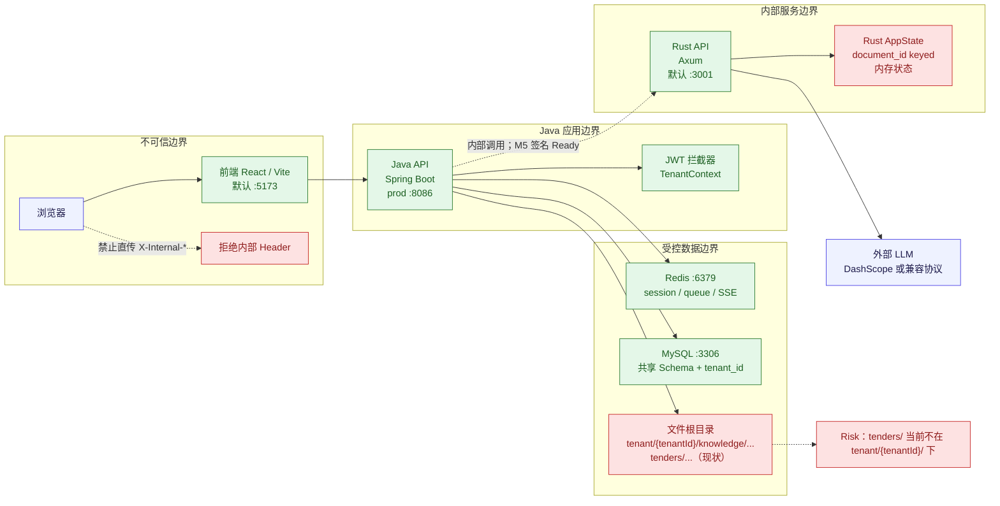
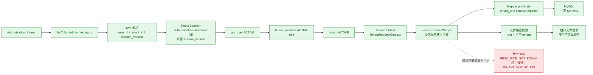

# 多租户系统拓扑图

 > 截至主线 `adf7478`。图中 `Ready`、`Pending`、`Risk` 是验收状态，不把 Pending 画成已实现。
 > M2/M3/M4：Ready；M5 最小签名：Ready；AuditIssue、Report、Chat、Trace 和完整异步隔离：Pending。
 > Java→Rust 实现与冻结的 T0 契约一致。

## 图例与边界

| 标记 | 含义 |
|---|---|
| Ready | 主线当前可用或已验收 |
| Pending | 契约或目标路径已定义，但主线仍未完成验收 |
| Risk | 当前实现存在隔离或部署风险 |

浏览器只能把 Bearer token 交给 Java API。浏览器不得发送、伪造或覆盖任何 `X-Internal-*`、`X-Tenant-Id`、`X-User-Id` 头；Java 是浏览器与 Rust 之间的边界。跨租户资源不泄露存在性，统一走 404 语义。

## 1. 运行时与部署拓扑

当前代码的文件路径并非所有类型都已完成租户目录隔离：知识库路径使用 `root/tenant/{tenantId}/...`，而招标文件上传仍从 `root/tenders/...` 生成。冻结契约要求的完整租户路径不能在本图中冒充 Ready。

### 最小端口与环境变量

以下只列仓库已有配置；没有现成配置名的内部密钥不自行命名。

| 组件 | 端口或变量 | 当前配置 |
|---|---|---|
| 前端 | AIBID_FRONTEND_PORT、AIBID_JAVA_BASE_URL | 默认 5173；Java 目标默认 `http://127.0.0.1:8086` |
| Java | server.port | prod 为 8086；基础 `application.yml` 为 8080，部署时确认使用哪个 profile |
| Rust | AIBID_RUST_BIND、AIBID_DATA_DIR | 默认 `127.0.0.1:3001`；数据目录默认当前目录 |
| MySQL | ST_DB_PORT、ST_MYSQL_ROOT_PASSWORD、ST_MYSQL_DATABASE | Compose 默认 3306、1234、smart_tender_system；Java 数据源当前固定 localhost:3306，部署时确认对齐 |
| Redis | — | Compose 6379；Java 使用 localhost:6379、database 10，未见对应环境变量 |
| Java JWT | ST_JWT_SECRET、ST_JWT_TTL_MILLIS | 生产 `ST_JWT_SECRET` 默认空，必须由部署提供；TTL 默认 86400000ms |
| Java 文件 | ST_DATA_ROOT、ST_UPLOAD_TENDER_DIR、ST_UPLOAD_KB_DIR、ST_PREVIEW_CACHE_DIR | 仅按现有 Spring 配置覆盖；生产文件根和预览根有固定覆盖值，部署时确认 |
| LLM / 嵌入 | DASHSCOPE_API_KEY、AIBID_LLM_PROTOCOL、EMBED_ENGINE | 默认协议为 dashscope、嵌入默认 local；remote 或 DashScope 路径需密钥 |
| OpenAI 兼容 | OPENAI_API_KEY、OPENAI_BASE_URL、LLM_MODEL | 仅 `openai_compatible` 路径使用 |
| Rust 搜索 | AIBID_SEARCH_BACKEND、SEARXNG_URL | 默认 dashscope；searxng 路径才使用 SEARXNG_URL |
| Java→Rust HMAC | RUST_API_INTERNAL_SECRET（Rust 兼容 fallback：AIBID_INTERNAL_API_SECRET） | adf7478 已接入；Java 与 Rust 注入同一非空密钥 |

配置依据：[vite.config.ts](../frontend/vite.config.ts)、[application.yml](../backend-java/src/main/resources/application.yml)、[application-prod.yml](../backend-java/src/main/resources/application-prod.yml)、[docker-compose.yml](../backend-java/src/main/resources/docker-compose.yml)、[Rust server.rs](../backend-rust/src/bin/server.rs)。

## 2. 同步请求链路

路径参数、请求体、查询参数不能建立租户归属。`TenantAuthorizationService` 只把路径租户作为候选值与当前上下文比较；资源 Service 和 Mapper 仍须显式带 `tenant_id` predicate，文件路径须在配置根目录内并检查当前租户。

## 3. M5 签名契约与异步审核现状

### 3.1 Java→Rust 最小签名链路与异步审核（M5 Ready / 异步隔离 Pending）

下图同时展示冻结 T0 签名链路（Ready）和当前异步审核实现；异步隔离虚线 Pending/Risk 不是已实现路径。

```mermaid
flowchart TB
  subgraph m5["M5 Java → Rust（Ready）"]
    M5J["Java TenantContext<br/>已验证上下文"] --> M5H["5 个 Header<br/>X-Tenant-Id<br/>X-User-Id<br/>X-Request-Id<br/>X-Internal-Timestamp<br/>X-Internal-Signature"]
    M5H --> M5C["8 行 canonical<br/>v1<br/>{METHOD}<br/>{path_with_query}<br/>{X-Internal-Timestamp}<br/>{X-Tenant-Id}<br/>{X-User-Id}<br/>{X-Request-Id}<br/>{lowercase_hex(SHA-256(body_bytes))}"]
    M5C --> M5S["HMAC-SHA256<br/>shared secret<br/>v1=lowercase hex"]
    M5S --> M5M["Rust middleware<br/>±300s<br/>replay key<br/>(tenant_id, request_id)<br/>600s"]
    M5M --> M5X["verified extension<br/>tenant_id / user_id<br/>request_id"]
    M5X --> M5R["资源 tenant_id<br/>二次校验"]
    M5Done["adf7478：M5 最小 HMAC<br/>已验收"] -. "Ready" .-> M5H
  end

  subgraph asyncFlow["异步审核：当前实现与待验收隔离"]
    AB["Bearer 请求<br/>创建审核任务"] --> AT["AuditTaskService<br/>写入 task.tenant_id"]
    AT --> AC["afterCommit<br/>dispatch(taskId)"]
    AC --> AQ["当前默认 async<br/>AuditTaskDispatcher<br/>只有 taskId"]
    AQ --> AW["@Async AuditEngine<br/>start(taskId)<br/>worker context Pending"]
    AW --> ARC["RustApiClient<br/>五 Header / HMAC<br/>已接入"]
    ARC --> ARM["Rust AppState<br/>document_id keyed<br/>tenant map Pending"]
    ARM --> ARS["Rust SSE<br/>document_id keyed<br/>scope Pending"]
    ARS --> ARSC["RustSseClient<br/>signed; scope Pending"]
    ARSC --> ASH["Java SseHub<br/>连接 key: taskId<br/>scope Risk"]
    ASH --> AEV["audit_task_event<br/>task_id + event_data<br/>tenant_id missing"]
    AEV --> ARP["replay(taskId, lastEventId)<br/>无 tenant predicate"]
    ARP --> AOUT["浏览器 SSE"]

    ENV["queue envelope tenant_id<br/>schema_version / actor / request_id<br/>Pending"] -.-> AQ
    CTX["worker TenantContext snapshot<br/>Pending"] -.-> AW
    SC["tenant-scoped SSE / replay<br/>Pending"] -.-> ASH
    SC -.-> ARP
  end

  classDef ready fill:#e4f7e8,stroke:#2e7d32,color:#1b5e20;
  classDef current fill:#e4f7e8,stroke:#2e7d32,color:#1b5e20;
  classDef pending fill:#fff4d6,stroke:#b7791f,color:#7a4d00,stroke-dasharray:5 4;
  classDef risk fill:#fde2e2,stroke:#c62828,color:#8e1b1b;
  class M5J,M5H,M5C,M5S,M5M,M5X,M5R,M5Done ready;
  class AB,AT,AC,AQ,ARC,AOUT current;
  class ENV,CTX,SC pending;
  class AW,ARM,ARS,ARSC,ASH,AEV,ARP risk;
```

契约没有第六个 `X-Nonce` Header；图中“nonce”由 `X-Request-Id`承担。`X-Internal-Timestamp` 是 Unix 秒，重放键按 `(tenant_id, request_id)` 做 600 秒保护。浏览器不得发送或伪造上述五个内部 Header，Rust 只接受 Java 内部调用的验证结果。

adf7478 已将五 Header、8 行 canonical、HMAC-SHA256、±300 秒时间窗、`(tenant_id, request_id)` 600 秒重放保护和 Rust verified extension 合入并验收为 Ready。异步队列 envelope、worker context、Rust document map/事件/磁盘路径租户化，以及 Java/Rust tenant-scoped SSE/replay 仍为 Pending/Risk。

真实异步现状：默认 `audit.queue.mode=async`，`afterCommit` 只传 `taskId`；Redis Stream/List 变体也只写 `taskId`、`retry`。`TenantContext.wrap` / snapshot 虽然存在，但当前审核 worker 路径没有显式恢复租户上下文。SSE 连接使用 `taskId`，Redis 状态键为 `sse:connection:{taskId}`；事件表和 replay 查询只有 `task_id`，没有 tenant-scoped predicate。

契约原文：[多租户接口契约](../backend-java/docs/多租户接口契约.md)（7.1，399-423）；隔离边界见 [tenant-isolation.md](./adr/tenant-isolation.md)。

## 主线状态与风险收口

| 范围 | 状态 | 说明 |
|---|---|---|
| M2 / M3 / M4 | Ready | 按主线程验收标记 |
| M5 Java→Rust | Ready | 最小签名已验收；Rust document/event/path 租户化仍 Pending |
| AuditIssue / Report / Chat / Trace | Pending | 不能从当前 MVP 租户链路推定完整隔离已完成 |
| 完整异步隔离 | Pending | queue envelope tenant、worker context、tenant-scoped SSE/replay 尚未闭环 |
| 当前招标文件路径 | Risk | 现有实现生成 root/tenders/...，未统一落入 tenant/{tenantId}/ |
| 当前 Rust 内存状态 | Risk | AppState 以 document_id 等全局 key 组织，M5 双重租户校验尚未完成 |

领域与契约参考：[README.md](../README.md)、[tenant-model.md](./adr/tenant-model.md)、[tenant-isolation.md](./adr/tenant-isolation.md)、[多租户接口契约](../backend-java/docs/多租户接口契约.md)。
